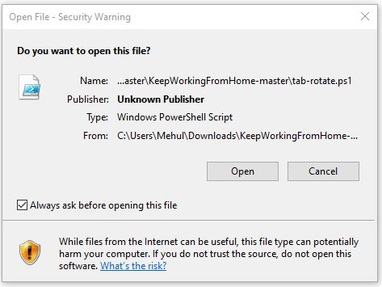
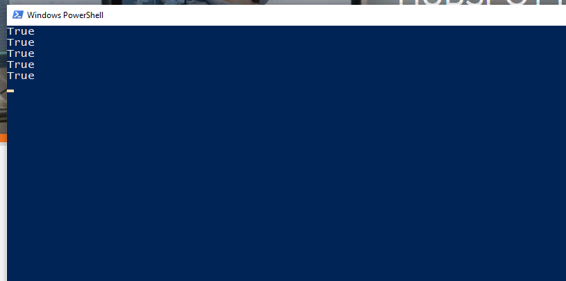

# KeepWorkingFromHome

# About
- If you dont want your Windows machine to go on sleep or locked state (Specially when you dont have access to `Power Options` as **admin**)

**OR**

- If you have multiple Dashboards in Browser and you want to display them in cyclic order

**OR**

- If you dont want to appear as **AWAY** :large_orange_diamond: on your office laptop but want to have a quick nap :sleeping:

Here is a trick for you. :sunglasses: :sunglasses: :sunglasses:

The Script simulates the bottons-press to rotate tabs(`Ctrl + Page Up` here) on your behalf. 

# Steps to Run the Script
1) Download the [Script file](tab-rotate.ps1) to your windows machine

2) Open Chorme Browser with atleast 2 tabs

3) Right-Click on File and Select `Run with PowerShell`

4) Accept the WARNING (if any)

5) Script will start running in PowerShell Window

6) Open the Chrome Browser Window now and you can leave your machine running

